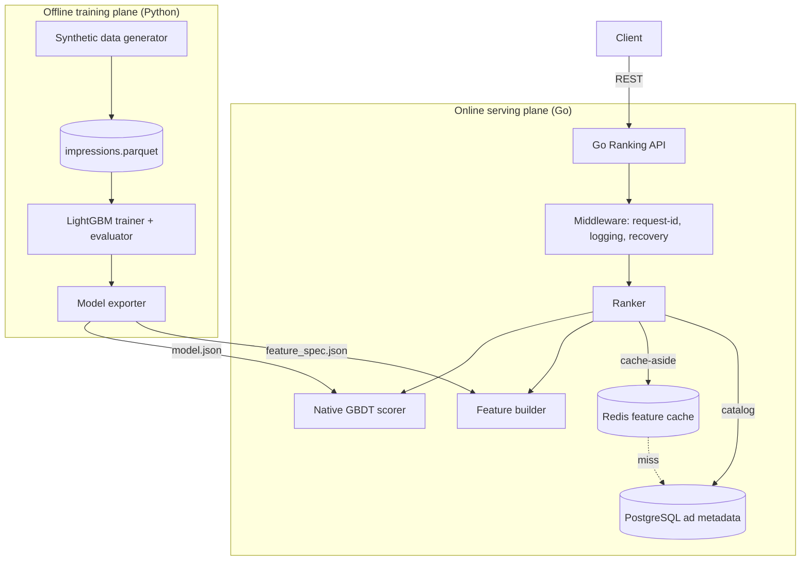
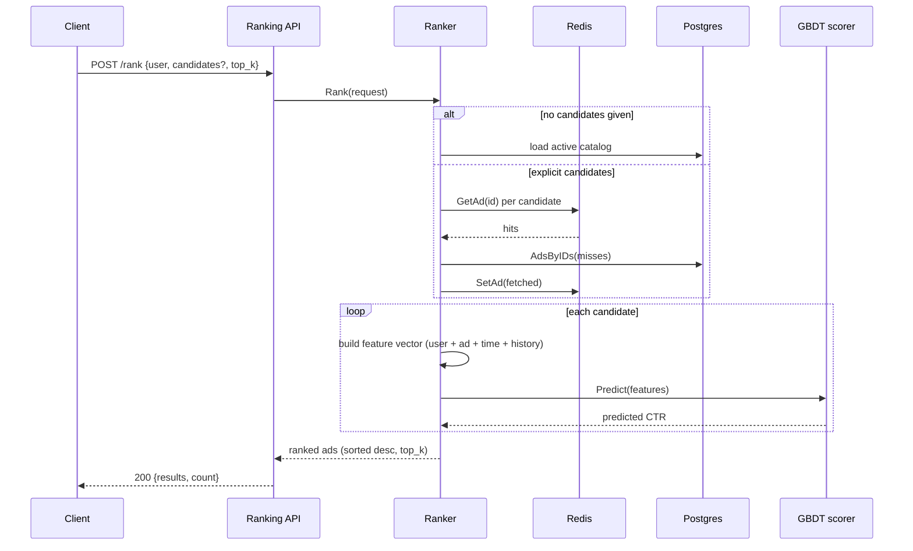
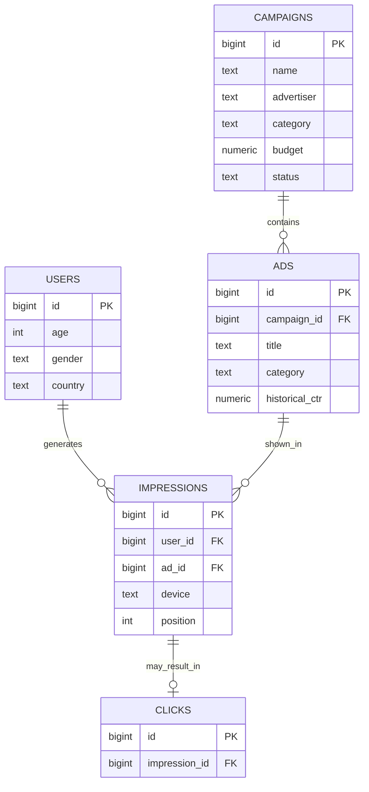

# Architecture

The system splits cleanly into an **offline training plane** (Python) and an
**online serving plane** (Go), connected by two serialized artifacts: the model
and the feature spec.

## Component overview

## Why this split

| Concern            | Plane    | Rationale                                                            |
| ------------------ | -------- | -------------------------------------------------------------------- |
| Model training     | Python   | Mature ML ecosystem (LightGBM, scikit-learn, pandas).                |
| Online inference   | Go       | Low-latency, low-allocation scoring; easy concurrency and deploys.   |
| Model transport    | JSON     | Language-agnostic; Go scores the tree ensemble with no Python.       |
| Feature contract   | JSON     | One spec, produced by Python, consumed by Go — no drift.             |

## The feature contract

Feature ordering and categorical vocabularies live in exactly one place
(`ml/src/ads_ml/schema.py`). Training serialises them to `feature_spec.json`; the
Go service loads that file and reproduces the encoding — including ordinal codes
and unknown-category fallback — so served features match trained features.

Because categoricals are ordinal-encoded, every decision-tree split is a numeric
`feature <= threshold` test. This lets the Go scorer walk each tree to a leaf and
sum leaf values, reproducing LightGBM's prediction exactly (asserted to 1e-9 by
the parity test in `ranking/internal/model`).

## Request flow: POST /rank

## Data model

## Deployment topology

`docker-compose` runs four services: `postgres`, `redis`, a one-shot `trainer`
that writes the model artifacts to a shared volume, and the `ranking` service
that serves the API once training completes and the datastores are healthy.

## Graceful degradation

The store and cache are interfaces. With no PostgreSQL DSN the service falls back
to a seeded in-memory catalog; with no Redis address it falls back to an
in-process cache. The service therefore runs end-to-end with zero infrastructure,
which keeps development and testing friction low.
